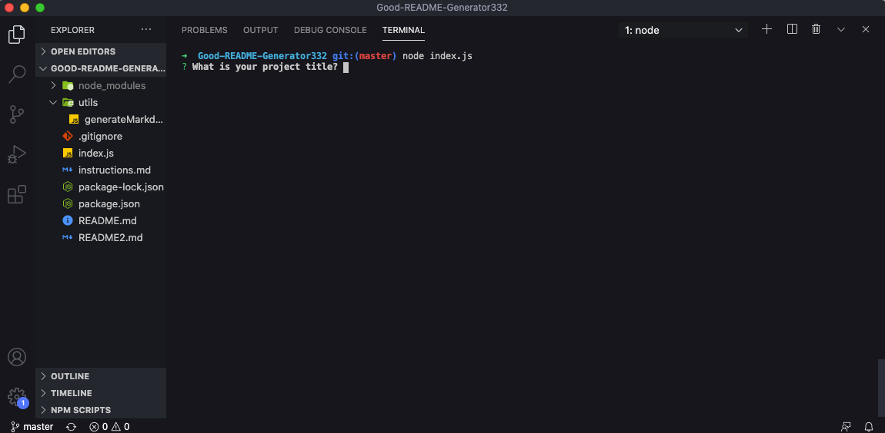
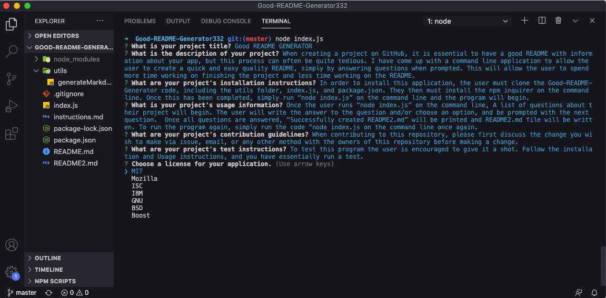
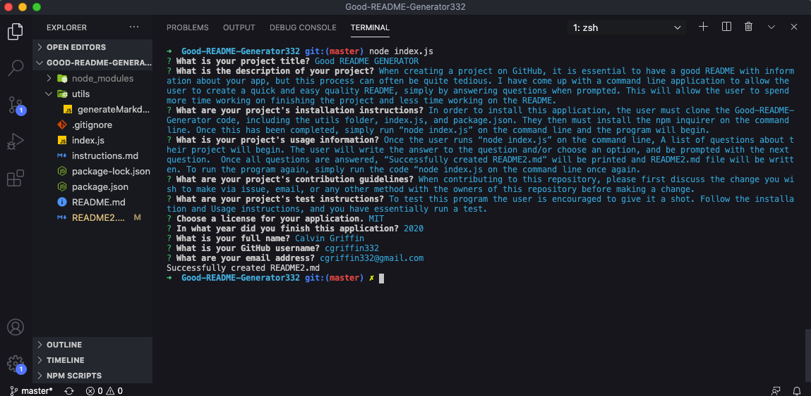
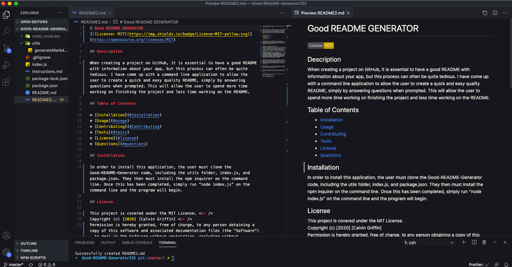

# Good-README-Generator332

## Description

When creating a project on GitHub, it is essential to have a good README with all the information about your app, but this process can often be quite tedious. I have come up with a command line application to allow the user to create a quick and easy quality README, simply by answering questions when prompted. This will allow the user to spend more time working on finishing the project, and less time working on the README.

## Table of Contents

* [Installation](#installation)
* [Usage](#usage)
* [Contributing](#Contributing)
* [License](#license)
* [Tests](#tests)
* [Questions](#questions)

## Installation

In order to install this application, the user must clone the Good-README-Generator code, including the utils folder, index.js, and package.json. They then must install the npm inquirer on the command line. Once this has been completed, simply run “node index.js” on the command line and the program will begin.

## Usage

Click link to view site in use:
https://drive.google.com/file/d/1uccGveArAeUxckec2jFak7Ylb1OB9hq6/view

Once the user runs “node index.js” on the command line, A list of questions about their project will begin. 

The user will write the answer to the question and/or choose an option, and then will be prompted with the next question.  

Once all questions are answered, “Successfully created README2.md” will be printed and README2.md file will be written. 

To run the program again, simply run the code “node index.js" on the command line.

## License

This project is covered under the MIT License.  
Copyright (c) [2020] [Calvin Griffin]  
Permission is hereby granted, free of charge, to any person obtaining a copy of this software and associated documentation files (the "Software"), to deal in the Software without restriction, including without limitation the rights to use, copy, modify, merge, publish, distribute, sublicense, and/or sell copies of the Software, and to permit persons to whom the Software is furnished to do so, subject to the following conditions:
The above copyright notice and this permission notice shall be included in all copies or substantial portions of the Software.
THE SOFTWARE IS PROVIDED "AS IS", WITHOUT WARRANTY OF ANY KIND, EXPRESS OR IMPLIED, INCLUDING BUT NOT LIMITED TO THE WARRANTIES OF MERCHANTABILITY, FITNESS FOR A PARTICULAR PURPOSE AND NONINFRINGEMENT. IN NO EVENT SHALL THE AUTHORS OR COPYRIGHT HOLDERS BE LIABLE FOR ANY CLAIM, DAMAGES OR OTHER LIABILITY, WHETHER IN AN ACTION OF CONTRACT, TORT OR OTHERWISE, ARISING FROM, OUT OF OR IN CONNECTION WITH THE SOFTWARE OR THE USE OR OTHER DEALINGS IN THE SOFTWARE.

## Contributing

When contributing to this repository, please first discuss the change you wish to make via issue, email, or any other method with the owners of this repository before making a change.

## Tests

To test this program the user is encouraged to give it a shot. Follow the installation and Usage instructions, and you have essentially run a test.

## Questions

If you have any additional questions, please contact me via email or GitHub by clicking the links below.

Email: cgriffin332@gmail.com  
GitHub: https://github.com/cgriffin332